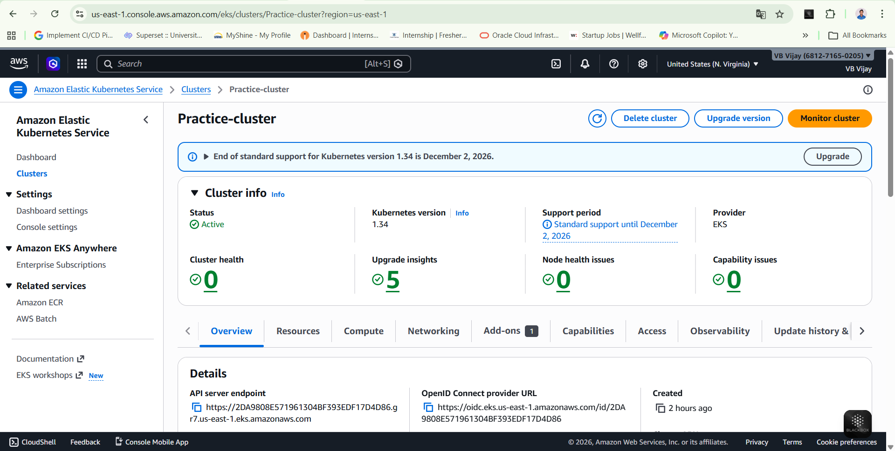
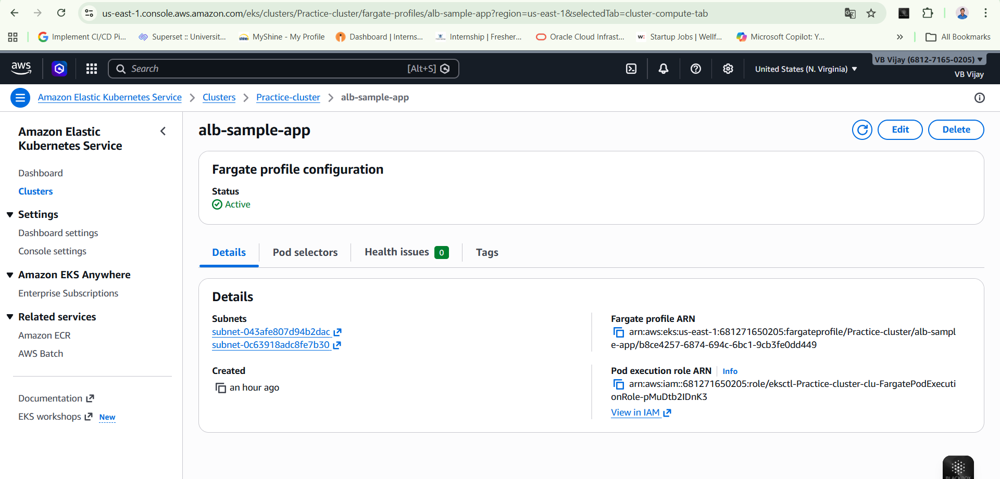
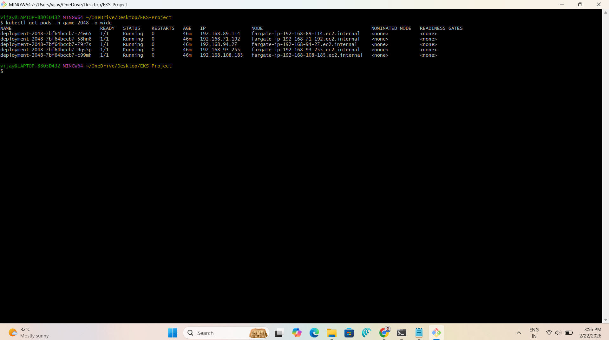
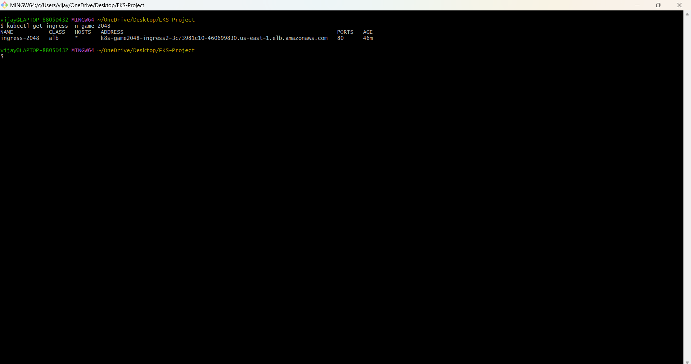
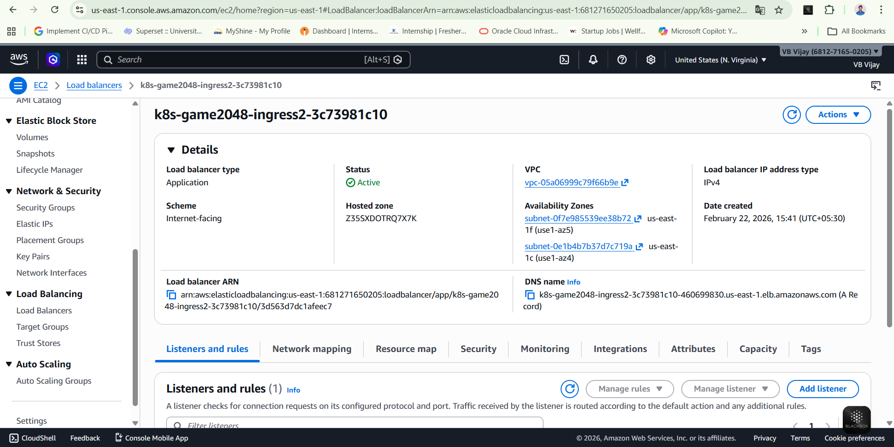
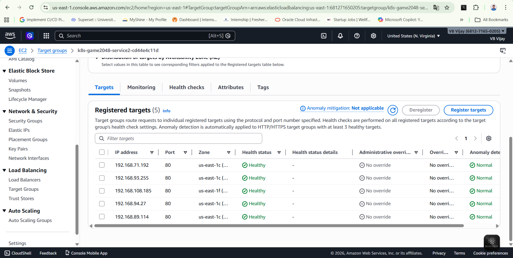
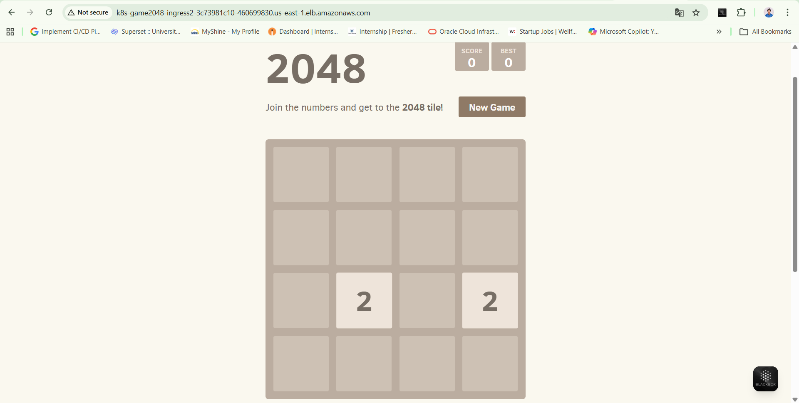

# 🚀 EKS Fargate Deployment – 2048 Game Application.

## 📌 Project Overview

This project demonstrates deploying a containerized application on **Amazon EKS** using **AWS Fargate** with **ALB Ingress Controller**.

The 2048 game application is deployed in a Kubernetes cluster and exposed to the internet using an AWS Application Load Balancer.

This project showcases production-style Kubernetes deployment using serverless compute.

---

## 🏗 Architecture

Internet  
↓  
Application Load Balancer (ALB)  
↓  
Target Group  
↓  
Kubernetes Service (ClusterIP)  
↓  
Pods (Running on AWS Fargate)

---

## 🛠 Tools Used

 

- AWS CLI
- kubectl
- eksctl
- Amazon EKS
- AWS Fargate
- AWS Load Balancer Controller

---

## ⚙️ Deployment Steps

### 1️⃣ Created EKS Cluster
```
eksctl create cluster --name Practice-cluster --region us-east-1 --fargate
```

### 2️⃣ Associated IAM OIDC Provider (IRSA)
```
eksctl utils associate-iam-oidc-provider \
  --cluster Practice-cluster \
  --region us-east-1 \
  --approve
```

### 3️⃣ Created Fargate Profile
```
eksctl create fargateprofile \
  --cluster Practice-cluster \
  --region us-east-1 \
  --name alb-sample-app \
  --namespace game-2048
```

### 4️⃣ Applied Kubernetes Manifests
```
kubectl apply -f yamls/
```

---

## 📂 Kubernetes Manifests Structure

```
yamls/
├── namespace.yaml
├── deployment.yaml
├── service.yaml
└── ingress.yaml
```

---

## 📸 Screenshots

### 1️⃣ EKS Cluster Active


---

### 2️⃣ Fargate Profile


---

### 3️⃣ Pods Running on Fargate


---

### 4️⃣ Ingress Resource with ALB DNS


---

### 5️⃣ Application Load Balancer (ALB)


---

### 6️⃣ Target Group – Healthy Targets


---

### 7️⃣ 2048 Game Running in Browser


---

## 🔐 Key Concepts Demonstrated

- Serverless Kubernetes using AWS Fargate
- IAM Roles for Service Accounts (IRSA)
- ALB Ingress Controller integration
- Kubernetes Service (ClusterIP)
- Target-type IP routing for Fargate
- Production-style Kubernetes networking

---

## 🎯 Outcome

Successfully deployed and exposed a Kubernetes application in a production-style AWS EKS environment using Fargate and ALB Ingress.

This project demonstrates practical DevOps skills in:

- Cloud infrastructure
- Kubernetes networking
- Load balancing
- IAM & security configuration
- Infrastructure automation

---

## 👨‍💻 Author

Vijay B.
DevOps Engineer | AWS & Kubernetes


